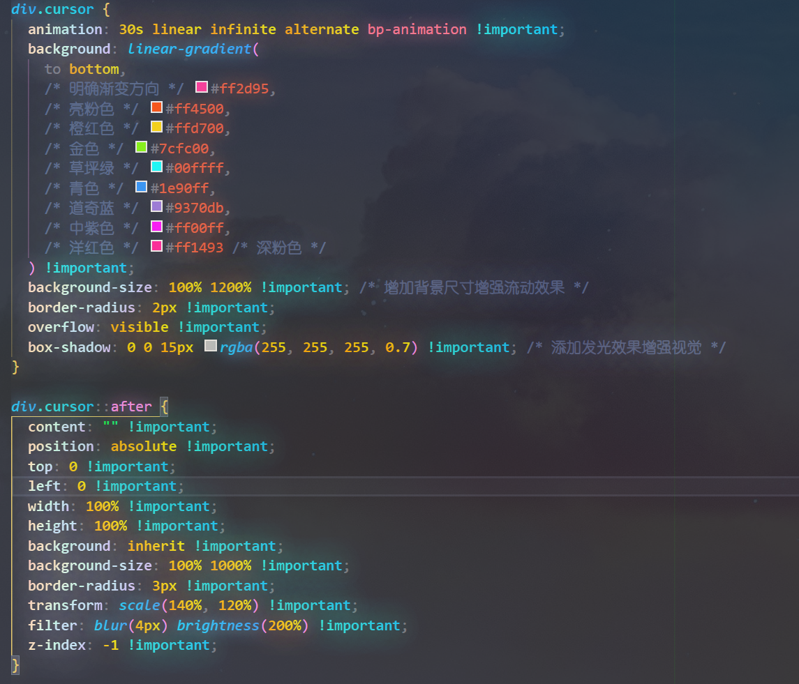
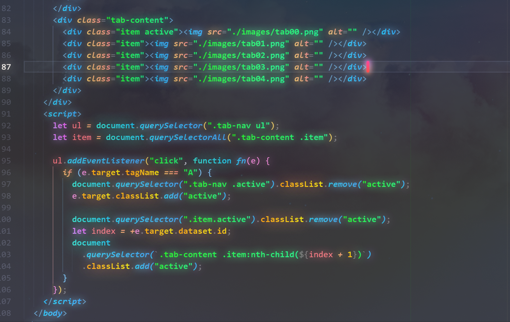

# 🌈 Woodfish Theme

> [English](README.en.md) | 中文

> 一个具有发光效果、渐变色彩和动画的VSCode彩虹主题扩展

[](https://github.com/woodfishhhh/Woodfish-Theme)
[](LICENSE)
[](https://code.visualstudio.com/)
[](https://marketplace.visualstudio.com/items?itemName=zhongjun.woodfish-theme)
[](https://github.com/woodfishhhh/Woodfish-Theme/releases)

## ✨ 特色功能

- 🌈 **彩虹光标**: 动态变化的彩虹光标动画，让编码更有趣
- ✨ **发光效果**: 代码关键字和行号发光效果，增强视觉体验
- 🎨 **渐变色彩**: 精心设计的渐变语法高亮，提升代码可读性
- 🔍 **透明UI**: 现代化的半透明菜单和悬停效果
- 📊 **活动栏动画**: 选中标签的渐变边框动画
- 🎯 **模块化设计**: 可按需自定义的模块化CSS架构
- 🚀 **性能优化**: 轻量级设计，不影响编辑器性能

## 🖼️ 预览




*展示彩虹光标、发光效果和渐变色彩的完整效果*

## 📦 安装

### 从VSCode扩展市场安装

1. 打开VSCode
2. 按 `Ctrl+Shift+X` 打开扩展面板
3. 搜索 "Woodfish Theme"
4. 点击安装

### 手动安装

```bash
# 下载并安装VSIX文件
code --install-extension woodfish-theme-2.3.0.vsix
```

## 🚀 使用方法

### 启用主题

1. 安装扩展后，按 `Ctrl+Shift+P` 打开命令面板
2. 输入 `Woodfish Theme: 启用 Woodfish Theme`
3. 选择并执行命令
4. 重启VSCode以应用更改

### 选择颜色主题

1. 按 `Ctrl+K Ctrl+T` 打开主题选择器
2. 选择 "Woodfish Dark"

## ⚙️ 自定义配置

在VSCode设置中可以自定义主题行为：

```json
{
  "woodfishTheme.customStyles": [
    {
      "enabled": true,
      "css": "/* 自定义CSS样式 */"
    }
  ]
}
```

### 自定义样式示例

```json
{
  "woodfishTheme.customStyles": [
    {
      "enabled": true,
      "css": "div.cursor { animation-duration: 20s !important; }"
    },
    {
      "enabled": true,
      "css": "span.mtk1 { text-shadow: 0 0 40px currentColor !important; }"
    }
  ]
}
```

## 🎨 主题特色

### 彩虹光标动画
- 6秒循环的彩虹渐变动画
- 发光效果增强视觉冲击
- 流畅的颜色过渡

### 语法高亮渐变
- HTML标签: 蓝色渐变
- 字符串: 绿色渐变  
- 关键字: 紫色渐变
- 变量: 橙色渐变
- 注释: 半透明效果

### 发光效果分级
- 高强度: 关键字、函数 (30px)
- 中等强度: 变量、字符串 (25px)
- 低强度: 注释、符号 (20px)
- 最小强度: 其他元素 (15px)

### 透明UI设计
- 悬停提示半透明背景
- 快速输入小部件透明效果
- 毛玻璃模糊效果

## 🛠️ 开发

### 环境要求

- Node.js >= 16.0.0
- VSCode >= 1.74.0
- Git

### 本地开发

```bash
# 克隆仓库
git clone https://github.com/woodfishhhh/Woodfish-Theme.git
cd Woodfish-Theme

# 安装依赖
npm install

# 打包扩展
npm run package
```

### 模块化架构

主题采用模块化设计，包含以下模块：

- `variables.css` - 主题变量定义
- `activity-bar.css` - 活动栏样式
- `tab-bar.css` - 标签栏样式
- `syntax-highlighting.css` - 语法高亮
- `glow-effects.css` - 发光效果
- `cursor-animation.css` - 光标动画
- `transparent-ui.css` - 透明UI

## 🤝 贡献

欢迎贡献代码！请查看 [贡献指南](CONTRIBUTING.md)。

### 贡献流程

1. Fork 本仓库
2. 创建特性分支 (`git checkout -b feature/amazing-feature`)
3. 提交更改 (`git commit -m 'Add amazing feature'`)
4. 推送到分支 (`git push origin feature/amazing-feature`)
5. 创建 Pull Request

## 📝 更新日志

### [2.3.0] - 2024-12-19

#### 新增
- 🚀 版本更新到3.0.0
- 🌈 修复更新了彩色光标功能
- 📝 更新项目文档
- 🎯 分散功能，可以各自打开


### [2.2.0] - 2024-12-XX

#### 新增
- 🌈 彩虹光标动画效果
- ✨ 代码发光效果系统
- 🎨 渐变语法高亮优化
- 🔍 透明UI设计
- 📊 活动栏动画效果
- 🎯 模块化CSS架构

#### 优化
- 性能优化，减少资源占用
- 动画流畅度提升
- 颜色对比度调整

### [2.1.1] - 2024-12-19
- 💫 为悬浮提示添加了毛玻璃背景效果
- 🐛 修复了悬浮菜单位置偏移问题
- 🎯 优化了悬浮提示的视觉效果

## 🐛 问题反馈

遇到问题？请：

1. 查看 [常见问题](https://github.com/woodfishhhh/Woodfish-Theme/wiki/FAQ)
2. 搜索现有 [Issues](https://github.com/woodfishhhh/Woodfish-Theme/issues)
3. [创建新Issue](https://github.com/woodfishhhh/Woodfish-Theme/issues/new)

## 📄 许可证

本项目采用 MIT 许可证 - 查看 [LICENSE](LICENSE) 文件了解详情。

## 🙏 致谢

- 感谢VSCode团队提供优秀的编辑器平台
- 感谢所有贡献者和用户的支持
- 灵感来源于现代设计趋势和用户体验最佳实践

## 📞 联系方式

- 作者: Woodfish
- QQ: [woodfish](3053932588)
- Email: [woodfish](woodfishhhh@163.com)
- GitHub: [@woodfishhhh](https://github.com/woodfishhhh)
- Issues: [问题反馈](https://github.com/woodfishhhh/Woodfish-Theme/issues)

---

⭐ 如果这个主题对您有帮助，请给我们一个星标！

